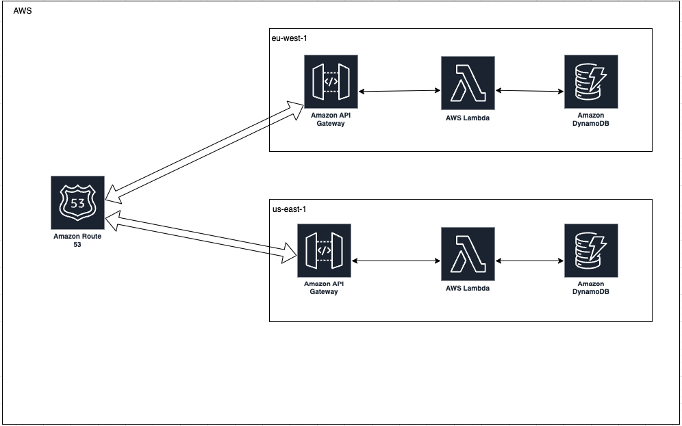

<!-- ## Useful commands

* `yarn build`   compile typescript to js
* `yarn cdk deploy`      deploy this stack to your default AWS account/region
* `yarn cdk diff`        compare deployed stack with current state
* `yarn cdk synth`       emits the synthesized CloudFormation template -->

# Task Backend Application

In this project, we need to create basic apis for managing task details. This APIs have basic role based authentication, authentication using apigateway custom authorization integration. POP for multi region deployment application.
 
# Table of contents  
1. [Problem Statement](#problem)
2. [Application Architechture](#paragraph1)
3. [Application Setup Steps](#paragraph2) 
4. [Test Cases Covered](#testcases)
<a name="problem"></a>
## Problem Statement

Design a multi region serverless application. In this application we need to solve following things.

1. Data Stored in serverless must be in user's region

    To solve this problem, we need to create dynamodb replication. For this CDK, at the time of creation of table we defined region in which we want dynamodb replicas. Added check over there that if stack is getting deployed to main region then only this replica get created otherwise it will just return the existing table name. This phenomenon is knows as ***DynamoDb Global Tables***

2. Resolving nearest region API Gateway

    For DNS resolving we are going to use Route 53.

<a name="paragraph1"></a>
## Application Architecture


<a name="paragraph2"></a>
Application Setup Steps
## Application Setup Steps
For doing setup of our application following thing need to be done.

1. Route 53 host zone setup
2. Update deploy.sh File
3. npm i
4. run command 
   ````
   npm i
   ````
5. run command
    ````
    sh deploy.sh
    ````

